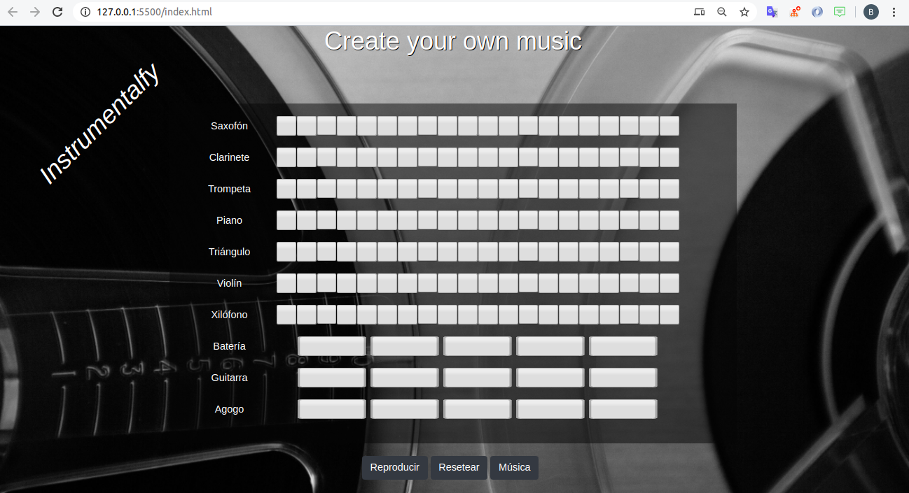

# instrumentalfy
Project #01 Bego - Fran
e-mail Fran: franqg99@gmail.com
e-mail Bego: herrerobego10@gmail.com

Este es un juego que consiste en la selección de sonidos para crear una melodía. Te da la posibilidad de oir sonidos de manera individual y posteriormente reproducir la música escogida.
Por otro lado, tiene el botón Reset, que permite empezar de cero.
El juego contiene un grupo de sonidos de un segundo(cortos), y unos de cuatro segundos(largos) que crearían la base de la melodía.

La idea era crear botones para aumentar y reducir velocidad, pero no hubo tiempo. Como mejora, se podría elegir sonidos. En principio, nuestro juego es una muestra ya seleccionada.

Puede mejorarse estilo y lógica, trabajando en ello.

